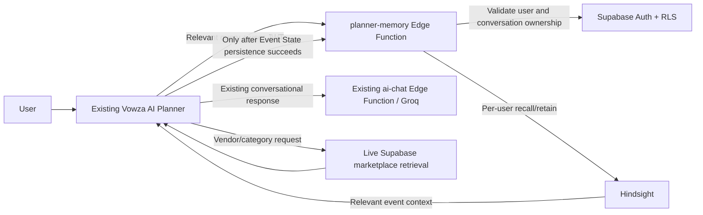

# Vowza — India's Premier Event Marketplace

**Where Talent Meets Celebration**

Vowza connects customers with verified event professionals — photographers, DJs, bands, makeup artists, decorators, caterers, pandits, banquet halls, and 50+ more categories — all from one trusted platform.

---

## Tech Stack

| Layer | Technology |
|---|---|
| Frontend | React 18, TypeScript, Vite |
| Styling | Tailwind CSS, shadcn/ui |
| Backend | Supabase (PostgreSQL + Auth + Storage) |
| State | TanStack React Query |
| Animations | Framer Motion |
| Charts | Recharts |
| Icons | Lucide React |

---

## Local Development

```bash
npm install
npm run dev
# → http://localhost:8080
npm test
npm run typecheck
npm run build
```

---

## Environment Variables

Copy `.env.example` to `.env` and fill in the existing public-by-design Supabase browser settings:

```env
VITE_SUPABASE_URL=https://your-project.supabase.co
VITE_SUPABASE_ANON_KEY=your-anon-key
```

Do not add Hindsight credentials or `VITE_HINDSIGHT_*` variables to frontend environment files.

---

## Hindsight Persistent Memory — AI Planner

Hindsight adds cross-session memory to the existing authenticated Vowza AI Planner. It stores normalized event facts only after an explicitly changed Event State has been persisted by Supabase. Relevant memories augment the existing Planner context; Supabase Event State and live marketplace results remain authoritative. Hindsight is never used to generate vendor records, and the existing `ai-chat` Edge Function/Groq path is preserved.

### Request flow



### Implementation

- `supabase/functions/planner-memory/index.ts` uses the official `@vectorize-io/hindsight-client` SDK for server-side `recall()` and `retain()`. It validates the Supabase JWT, confirms the conversation belongs to that user under RLS, derives a user-scoped bank, applies timeouts, and fails open.
- `supabase/functions/_shared/plannerMemory.ts` validates/normalizes allow-listed facts, redacts sensitive text, gates retention on explicit changes, and prefers newer compatible values.
- `src/lib/plannerMemoryClient.ts` calls the authenticated Edge Function; `src/lib/llm.ts` recalls relevant context before the existing Planner response path; `src/components/ai/useAIChat.ts` retains only after successful Supabase Event State persistence.
- Added: `supabase/functions/planner-memory/{index.ts,deno.json,deno.lock}`, `supabase/functions/_shared/plannerMemory.ts`, `src/lib/plannerMemoryClient.ts`, and `src/lib/__tests__/plannerMemory.test.ts`.
- Modified: `src/lib/llm.ts`, `src/components/ai/useAIChat.ts`, `supabase/config.toml`, `package.json`, and this README. `supabase/functions/ai-chat/index.ts` is unchanged.

### Credentials and deployment

In the Supabase project dashboard, add `HINDSIGHT_BASE_URL` and `HINDSIGHT_API_KEY` under **Edge Function Secrets**—never in `.env`, source control, or browser code. Then deploy from the linked Vowza project:

```bash
supabase functions deploy planner-memory
```

### Cross-session demo

1. Sign in as one Vowza user. In a Planner conversation, state an event type/location, guest count, and budget; then correct the budget (for example, ₹5 lakh → ₹7 lakh).
2. Start a **new conversation** as the same user and ask, “What do you remember about my event?” The Planner should recall the event and latest budget through Hindsight.
3. Ask for a service such as photographers. Any vendor results must come from the existing live Supabase marketplace retrieval, not memory. A second user must not see the first user's memories.

The Hindsight Edge Function is an optional enhancement: missing secrets, timeouts, or provider errors leave the existing Planner behavior available without exposing provider errors to the user.

---

## Database Setup

Run the SQL migrations in order in the Supabase SQL Editor:

1. `supabase/migrations/20260728000000_notifications_rls.sql`
2. `supabase/migrations/20260801000000_dynamic_marketplace_v2.sql`

---

## Key Features

- **Dynamic Category Marketplace** — 20 categories, each with subcategories, filters, and verified vendor listings
- **Vendor Profiles** — Cover image, portfolio gallery, pricing packages, FAQs, availability calendar
- **Category-Aware Vendor Dashboard** — Edit only the fields relevant to your profession
- **AI Event Planner** — Describe your event, get a full vendor list + budget breakdown
- **Admin Panel** — Approve/reject vendors, manage categories, view analytics
- **Secure Payments** — Escrow model via Razorpay (integration ready)
- **Real-time Notifications** — Booking updates, admin approvals, announcements

---

## Admin Setup

To promote a user to admin, run in the Supabase SQL Editor:

```sql
INSERT INTO public.user_roles (user_id, role)
VALUES ('<your-user-uuid>', 'admin')
ON CONFLICT DO NOTHING;
```

Then navigate to `/admin/dashboard`.

---

## License

© Vowza Technologies Pvt. Ltd. All rights reserved.
