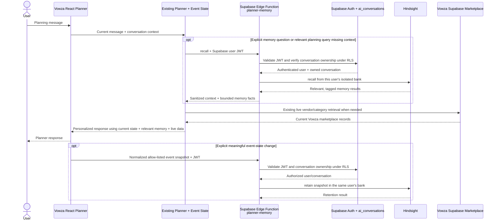

# Vowza — India's Premier Event Marketplace

**Where Talent Meets Celebration**

Vowza connects customers with verified event professionals — photographers, DJs, bands, makeup artists, decorators, caterers, pandits, banquet halls, and 50+ more categories — all from one trusted platform.

---

## Tech Stack

| Layer | Technology |
|---|---|
| Frontend | React 18, TypeScript, Vite |
| Styling | Tailwind CSS, shadcn/ui |
| Backend | Supabase (PostgreSQL + Auth + Storage) |
| State | TanStack React Query |
| Animations | Framer Motion |
| Charts | Recharts |
| Icons | Lucide React |

---

## Local Development

```bash
# Install dependencies
npm install

# Start dev server
npm run dev
# → http://localhost:8080

# Run tests and typecheck
npm test
npm run typecheck

# Build for production
npm run build
```

---

## Environment Variables

Copy `.env.example` to `.env` and fill in your Supabase credentials:

```env
VITE_SUPABASE_URL=https://your-project.supabase.co
VITE_SUPABASE_ANON_KEY=your-anon-key
```

These are the existing public-by-design Supabase browser settings. **Do not add Hindsight credentials or `VITE_HINDSIGHT_*` variables here.** See [Hindsight Persistent Memory](#hindsight-persistent-memory) for server-side setup.

---

## Hindsight Persistent Memory

Vowza's existing AI Event Planner uses the official Hindsight TypeScript SDK as an **additive, persistent memory layer**. The React app never calls Hindsight directly: it invokes the authenticated `planner-memory` Supabase Edge Function. The existing Planner, Event State, Groq path, RAG retrieval, Supabase database, and marketplace remain in place.

### Architecture and request flow



### What is remembered—and when

- The Planner requests recall for an explicit question such as “What do you remember about my event?” or a relevant planning request that lacks core event context. It does **not** inject all memories into every prompt.
- After Event State sync, the app sends a retention request only when the turn changed an allow-listed field and the user's message explicitly mentions that field.
- Retained snapshots contain normalized event facts and preferences such as event type, city/locality, date, guests, budget, and supported style/food preferences. Raw chat transcripts, credentials, payment details, cultural attributes, special requirements, and vendor records are not copied into Hindsight.
- Newer compatible snapshots take precedence; older compatible snapshots can fill fields a newer conversation did not restate. A conflicting current event type/location is not blended with another event's memories. Current-turn details always win.

### Authority and isolation

- **Hindsight** stores long-term, user-provided planning context and returns relevant memories.
- **Vowza Event State** remains the current structured planning state.
- **Supabase** remains authoritative for users, vendors, profiles, prices, packages, availability, bookings, payments, and marketplace records.
- **The existing Planner** continues to orchestrate responses and the existing live marketplace/RAG path.
- Each bank ID is derived server-side from the authenticated Supabase user UUID. The Edge Function validates the JWT, checks that the supplied `ai_conversations` row belongs to that user under RLS, and only then reads/writes that user's Hindsight bank. The function also has `verify_jwt = true` in `supabase/config.toml`.
- Hindsight API credentials belong only in Supabase Edge Function secrets. They must never be committed, placed in a README or browser bundle, or exposed through a `VITE_*` variable.

### Configure and deploy

In the Supabase project dashboard, add these **Edge Function secrets** (not frontend `.env` variables):

- `HINDSIGHT_BASE_URL` — Hindsight deployment base URL (Hindsight Cloud default: `https://api.hindsight.vectorize.io`).
- `HINDSIGHT_API_KEY` — the Hindsight API key.

Then deploy the function from the linked Vowza project:

```bash
supabase functions deploy planner-memory
```

The function's `deno.json` pins the Supabase import map, and its server code pins `@vectorize-io/hindsight-client@0.10.1`. No browser SDK, database migration, or frontend Hindsight secret is needed.

### Real cross-session demo walkthrough

Run this with Hindsight secrets configured and `planner-memory` deployed; sign in as the **same Vowza account** for both conversations:

1. Start a Planner conversation and send: “I'm planning my sister's wedding in Hyderabad.”
2. Send: “We expect about 500 guests.”
3. Send: “Our budget is ₹5 lakh.” Wait for each Planner turn to finish so the authenticated Event State sync and best-effort Hindsight retention can run.
4. Correct the value in that conversation: “My budget is now ₹7 lakh.” This should replace that conversation's previous snapshot value.
5. Start a **new Planner conversation** and ask: “What do you remember about my event?” The answer should recall the wedding, Hyderabad, about 500 guests, and the latest ₹7 lakh budget from Hindsight.
6. In the new conversation ask: “Help me find photographers.” The Planner should use recalled event context while the existing Vowza marketplace retrieval supplies any vendor results. It must not invent vendors if live retrieval is unavailable.
7. As an isolation check, sign in as a different test user and ask the same memory question; the first account's event must not appear.
8. As a failure check, make Hindsight unavailable in a test deployment; the normal Planner should continue through its existing context/RAG/Groq behavior without exposing provider errors.

The actual integration is visible in the files below; no hardcoded memory or local-storage substitute is used.

### Implementation map

| File | Responsibility |
|---|---|
| `supabase/functions/planner-memory/index.ts` | Server-only official SDK client calls for `recall()` and `retain()`, JWT validation, conversation-owner check, per-user bank, timeout, safe logging, and graceful fallback. |
| `supabase/functions/planner-memory/deno.json` | Edge Function import map. |
| `supabase/functions/_shared/plannerMemory.ts` | Shared allowlists, sensitive-text redaction, meaningful-retention gate, normalized snapshot, relevance selection, and latest-compatible-memory merging. |
| `src/lib/plannerMemoryClient.ts` | Typed browser calls through Supabase; sends a minimal allow-listed Event State snapshot. |
| `src/lib/llm.ts` | Decides when recall is relevant, merges recalled context, answers explicit memory questions, and grounds the existing response path with bounded memory facts. |
| `src/components/ai/useAIChat.ts` | Passes the authenticated conversation ID and starts non-blocking retention after Event State sync. |
| `supabase/config.toml` | Requires JWT verification for `planner-memory`. |
| `src/lib/__tests__/plannerMemory.test.ts` | Tests user-bank separation, sensitive-data scrubbing, explicit-retention gating, relevance, event isolation, and latest-value behavior. |

### Failure behavior

Hindsight calls are time-bounded and caught server-side. A missing secret, unavailable service, timeout, or first-use empty bank does not block the normal Planner; provider errors and user text are not returned in server logs or client error messages. Current Vowza context and live Supabase data remain the fallback and source of truth.

---

## Database Setup

Run the SQL migrations in order in the Supabase SQL Editor:

1. `supabase/migrations/20260728000000_notifications_rls.sql`
2. `supabase/migrations/20260801000000_dynamic_marketplace_v2.sql`

---

## Key Features

- **Dynamic Category Marketplace** — 20 categories, each with subcategories, filters, and verified vendor listings
- **Vendor Profiles** — Cover image, portfolio gallery, pricing packages, FAQs, availability calendar
- **Category-Aware Vendor Dashboard** — Edit only the fields relevant to your profession
- **AI Event Planner** — Describe your event, get a full vendor list + budget breakdown
- **Admin Panel** — Approve/reject vendors, manage categories, view analytics
- **Secure Payments** — Escrow model via Razorpay (integration ready)
- **Real-time Notifications** — Booking updates, admin approvals, announcements

---

## Admin Setup

To promote a user to admin, run in the Supabase SQL Editor:

```sql
INSERT INTO public.user_roles (user_id, role)
VALUES ('<your-user-uuid>', 'admin')
ON CONFLICT DO NOTHING;
```

Then navigate to `/admin/dashboard`.

---

## License

© Vowza Technologies Pvt. Ltd. All rights reserved.
